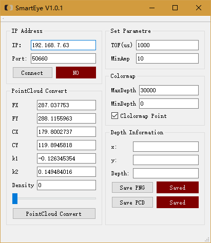
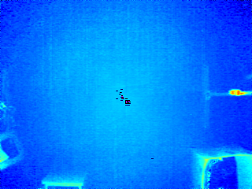
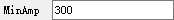
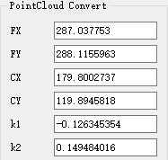
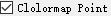

# SmartEye  
  

# Description
基于QT、PCL和Opencv与实验室EPC660相机建立tcp-socket通信操作软件，提供实时显示点云、保存16位深度图像等功能

# Environmet

Windows 10

VS2013

QT5.7.0 64bit

OenCV2.4.13

PCL1.8.0 64bit

# Update  
* V 1.0.1
修复信号强度设置问题；  
修复socket连接超时问题；  
优化伪彩色图像染色算法；  
优化点云显示；  
连接自动发送初始化指令；  
新增点云数据点击查看功能。  

* V 1.0.0  
优化UI；  
新增调整积分时间、最小强度功能；  
新增点云伪彩色染色功能；  
新增点云密度调节功能；  
修复BUG。  

* V 0.9.0    
预览版，完成图像获取和点云显示功能。 

# Compiling
**（仅测试windows）**
* 复制opencv2.4.13环境文件到工程目录下，debug/release分别命名为：OpenCV2.4_Win64_Debug.props和OpenCV2.4_Win64_Release.props（更高版本应该也支持，但没有测试）

* 复制pcl1.8.0环境文件到工程目录下，debug/release分别命名为：PCL_1.8.0_x64_debug.props和PCL_1.8.0_x64_release.props（更高版本应该也支持，但没有测试）

* 用vs打开工程（我们使用VS 2013）

* 解决方案平台选择x64（未经win32平台测试）

* QT5->Qt Project Settings，设置Qt版本（仅测试了Qt 5.7.0）

* 编辑调试

# Contents

双击SmartEye.exe即可运行，界面如下：  
 

## 1.图片功能

### 1.1 显示伪彩色图像

当点击Connect按钮时，会弹出新的界面，显示伪彩色图像(自由调节大小)。  

### 1.2 显示图像深度  

当鼠标左键点击伪彩色图像时，可以实时显示该点的坐标及深度值。  
   
紫色部分为过曝点。  
黑色部分为无效点。  
有效数据按近红远绿的规律显示。  

### 1.3 保存深度图像  

点击Save按钮  ，可以实时保存16bits的png图像(自由选择保存路径)，再次点击该按钮，保存结束。  

## 2.相机参数调整

### 2.1 调整积分时间

ToF(us)后修改积分时间数值  ，回车，即可修改相机积分时间。  

### 2.2 调整最小强度值

MinAmp后填写最小强度阈值，小于阈值的像素会被标记为无效点。  
 
## 3.点云显示
 
### 3.1 实时显示点云
 
点击PointCloud Convert ，可以实时显示点云。再次点击，则关闭点云显示。  

### 3.2 修改畸变系数及内参
 
可以自由修畸变系数（k1、k2）及内参（FX、FY、CX、CY）。  
  
程序启动会自动寻找同目录下的config.txt文件并读取畸变参数。  
  
### 3.3 点云显示伪彩色染色

勾选Colormap Point选项点云会按照深度伪彩色图像染色。不勾选则默认白色显示。  

### 3.4 点云显示密度设置

修改Density值可以更改点云显示密度，点数越多对电脑性能要求越高。  
数字越小密度越大，最小0。

### 3.5 点云显示大小设置

拖动滑块，可以选择点云显示时每个点的大小。范围1~10。  

 

